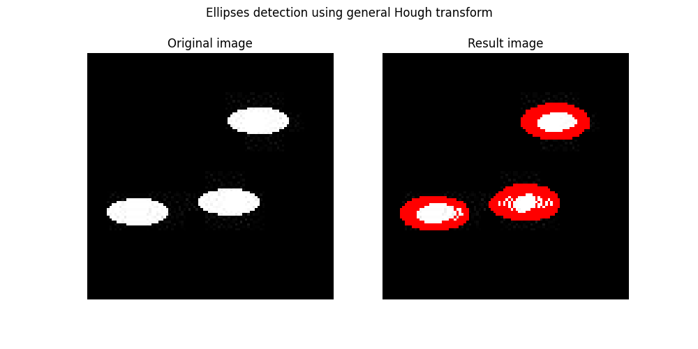

## Обобщенное преобразование Хафа для эллипсов
Ищет на изображении эллипсы с параметрами параметрами а, b от 4 до 15 пикс.,
имеющие угол наклона не более 10 градусов.  
В качестве результата выдает множетсво параметров эллипсов.

### Пример:

